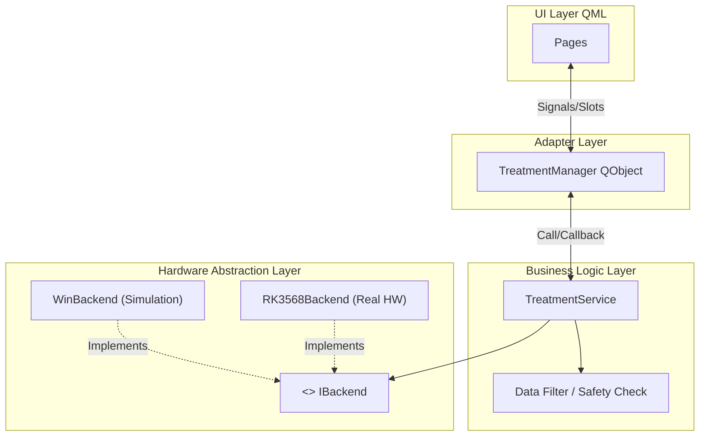

# 电刺激控制系统

> 一个基于 **RK3568 (Linux)** 与 **Cortex-M0** 双核异构架构的电刺激设备控制系统。采用 Qt6/QML 构建现代化 UI，通过 SPI 实现两核之间的通信。

##  系统架构 (System Architecture)

本项目采用 **上位机 + 下位机** 的设计，确保了 UI 的流畅性与脉冲输出的实时性。

* **Host (上位机)**: Rockchip RK3568 (Arm64)
    * 运行嵌入式 Linux 系统。
    * 基于 **Qt6.x + QML** 开发，负责业务逻辑、数据可视化、用户交互。
    * 通过 `spidev` 驱动与下位机通讯。
* **Slave (下位机)**: Cortex-M0 单片机
    * 负责 PWM 波形发生、ADC 同步采集
    * 作为 SPI Slave 响应上位机指令。
##  核心功能 (Key Features)

* **微秒级精准控制**: 支持 `us` (微秒) 和 `ms` (毫秒) 级正负脉宽调节，正负幅值调节
* **实时波形监控**: 基于 QML `Canvas` 实现 50Hz+ 的高帧率电压/电流波形绘制。
* **多维数据分析**: 实时计算 **瞬时功率 (mW)**、**累计能量 (J)**、**负载阻抗 (Ω)**。
* **智能安全保护**:
    * 电极脱落检测 (Open Circuit Detection)。
    * 过流/过压保护。
    * 通信超时自动急停。
* **现代化 UI 设计**: 采用 Glassmorphism (毛玻璃) 风格，支持深色模式，触控友好，这里的UI使用了EvolveUI的很多组件，下面是其项目地址
* `https://github.com/sudoevolve/EvolveUI`

##  后端架构 (Backend Architecture)
本系统后端基于** Modern C++ (C++17)** 开发，采用分层解耦架构，确保了业务逻辑与底层硬件的完全分离。
### 1. 架构概览 (Architecture Overview)
系统自上而下分为三层：**UI 适配层**、**核心业务层**、**硬件抽象层 (HAL)**。

### 2.关键设计模式与模块
#### A. 硬件抽象层 (HAL - Hardware Abstraction Layer)
为了实现Windows 开发调试，RK3568 部署，我们设计了统一的硬件接口。
- **`IBackend` (Interface)**: 定义了 `start()`, `stop()`, `updateParam()` 等纯虚函数，作为基类。
    
- **`RK3568Backend`**: 真实硬件实现。
    
    - 封装 Linux `spidev` 驱动接口 (`ioctl`)。
        
    - 实现 SPI 协议的打包、解包与 CRC 校验。
        
- **`WinBackend`**: 模拟器实现。
    
    - 方便在windows上进行调试 

#### B. 核心业务层 (Treatment Service)
负责纯逻辑处理，不依赖任何 UI 控件。
- 信号处理: 内置 滑动平均滤波 (Moving Average Filter) 与 死区限制 (Dead-zone Limiter)，剔除底噪，保证波形平滑。
    
- 状态机管理 (FSM): 严格维护 Idle -> Running -> Paused -> Error 状态流转，防止非法操作。
- 
#### C. 控制器 (Treatment Manager)
连接 QML 前端与 C++ 后端。
- 使用 Qt 的 信号槽机制 (Signals & Slots) 实现前后端解耦。
    
- 利用 Q_PROPERTY 暴露系统状态，实现 MVVM 模式的数据绑定。

### 3.并发模型 (Concurrency Model)
为了保证实时性，我们将 UI 线程与工作线程分离。
- **Main Thread (UI)**: 仅负责界面渲染和用户交互响应，严禁执行阻塞操作
- **Worker Thread (Backend)**:

- 在一个独立的 `QThread` 中。
    
- 运行定时器进行 SPI 读取循环。
    
- 数据通过 `QueuedConnection` 跨线程安全地传递给 UI 层。
